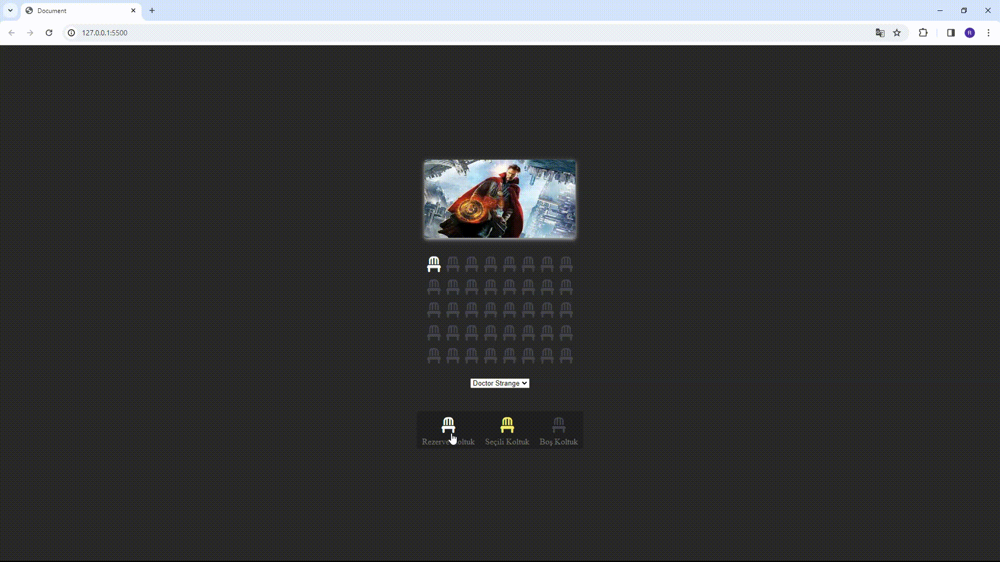

<h1>Reservation-Project</h1>

Özellikler

-Kullanıcılar, listeden bir film seçebilir ve uygun koltukları seçerek rezervasyon yapabilir.

-Seçilen koltuklar yerel depolama kullanılarak kaydedilir, böylece kullanıcı sayfayı kapatıp tekrar açtığında rezervasyonları görüntülenebilir.

-Toplam seçilen koltuk sayısı ve ödenecek toplam tutar her seçimde güncellenir.

-Rezervasyon yapılan koltuklar görsel olarak işaretlenir.

